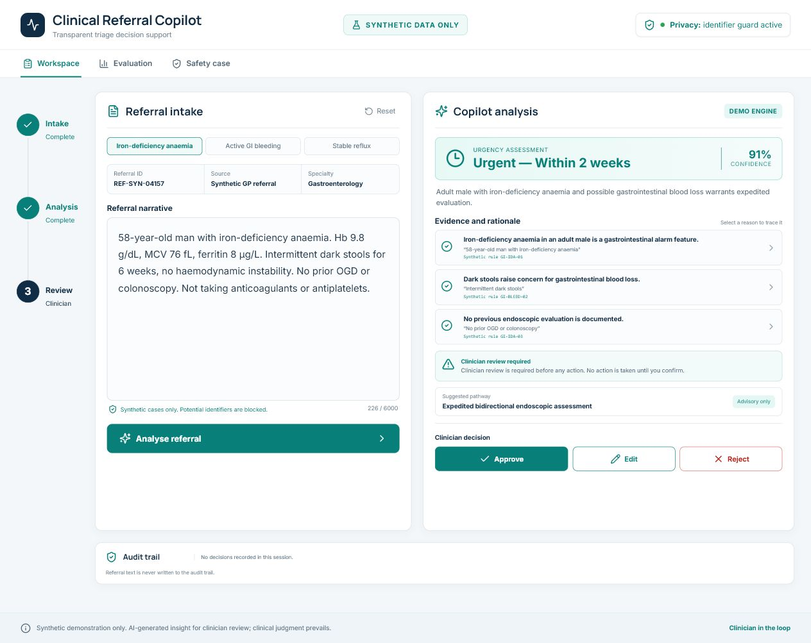
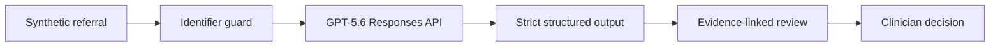

# Clinical Referral Copilot

A clinician-in-the-loop referral triage demonstration built for **OpenAI Build Week 2026**. It turns a synthetic gastroenterology referral into structured facts, a transparent urgency recommendation, traceable evidence, uncertainty and a suggested pathway. The clinician remains the final decision-maker.

> **Synthetic data only. Not a medical device. Not for clinical use.**

- **Live demonstration:** https://clinical-referral-copilot.vercel.app
- **Build Week submission materials:** [`submission/`](submission/)



## Why this exists

Referral triage is cognitively repetitive but clinically consequential. Important facts are buried in narrative text, local rules are difficult to apply consistently, and the final rationale is rarely captured in a reusable form. Clinical Referral Copilot demonstrates a safer interaction pattern: AI structures and explains; a clinician approves, edits or rejects.

## Product experience

- Three selectable synthetic gastroenterology referrals
- GPT‑5.6 reasoning through the OpenAI Responses API
- Strict JSON Schema output for predictable rendering
- Exact source-phrase → rationale → synthetic-rule traceability
- Clinician approve, edit and reject controls
- Session-only audit trail that stores no referral narrative
- Synthetic evaluation dashboard and explicit safety case
- Common Singapore identifier, phone and email blocking
- High-confidence prompt-injection blocking and content-free security audit events
- Best-effort per-instance request limiting for the public demonstration
- Exact-quote validation before live model evidence is rendered
- Deterministic demonstration fallback when no API key is configured

## Architecture



The OpenAI key is used only in the server-side route. Requests use `store: false`. The deployed demonstration must never receive real patient data.

The public API applies deterministic identifier and prompt-injection guards before the model call, caps output tokens, and rejects evidence quotes that are not present in the submitted narrative. Its in-memory request limiter is a demonstration safeguard, not a substitute for a durable distributed rate limiter or Vercel Firewall policy.

## Run locally

Requirements: Node.js 20 or newer.

```powershell
npm install
Copy-Item .env.example .env.local
# Add OPENAI_API_KEY to .env.local for live GPT-5.6 analysis.
npm run dev
```

Open <http://localhost:3000>. Without an API key, the application remains fully testable using its deterministic demonstration engine.
Live analysis requires a key from an OpenAI Platform project with available API quota. If the upstream model is unavailable, the interface visibly labels the deterministic fallback as `DEMO ENGINE`.

## Verify

```powershell
npm run lint
npm test
npm run build
```

## How Codex and GPT‑5.6 were used

### Codex collaboration

Codex was used as the primary engineering collaborator during the eligible hackathon period. It helped:

- inspect two earlier repositories read-only to understand the problem and privacy lessons;
- define a clean-room hackathon scope rather than copying the prior implementation;
- compare three visual directions and translate the chosen design into a responsive interface;
- implement the complete Next.js product, API boundary, schema, fallback and safety surfaces;
- verify build quality and browser behavior; and
- prepare the repository and submission documentation.

The human product decisions were the problem selection, project name, clinician-in-the-loop boundary, synthetic-only scope, target workflow and final visual direction.

### GPT‑5.6 in the product

GPT‑5.6 performs the referral reasoning. It receives a synthetic narrative plus a bounded demonstration policy and returns schema-constrained:

- urgency and timeframe;
- extracted clinical facts;
- reasons with exact source quotes;
- synthetic rule labels;
- missing information;
- a suggested pathway; and
- a safety note.

It cannot book appointments, send messages or take clinical action. The interface requires a clinician decision.

## What is new for Build Week

This repository is a fresh implementation created during OpenAI Build Week. Earlier repositories were consulted only for domain context and safety lessons. New work includes the product concept, visual design, clean-room Next.js architecture, GPT‑5.6 structured reasoning route, traceable evidence interaction, synthetic evaluation view and safety-case interface.

## Limitations and next steps

- The synthetic evaluation is illustrative and too small for clinical claims.
- Identifier patterns reduce accidental misuse but do not constitute de-identification.
- Model output can be incomplete or incorrect.
- Real deployment would require locally approved policies, representative evaluation, clinical safety review, privacy impact assessment, cybersecurity testing, monitoring and accountable governance.
- A future version could measure clinician–AI agreement, override reasons, subgroup performance and drift without storing raw referral text.

## Technology

Next.js, React, TypeScript, OpenAI Responses API, GPT‑5.6, strict JSON Schema and Lucide icons.

## License

MIT
